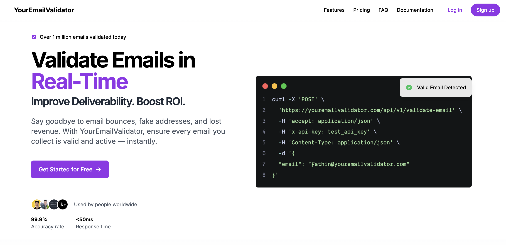

<br /><br />

<p align="center">
<a href="https://youremailvalidator.com">
  
</a>
</p>

<h3 align="center"><b>Your Email Validator</b></h3>
<p align="center"><b>Effortlessly validate email addresses </b></p>

<!-- <p align="center">
<a href="https://youremailvalidator.com">

</a>

</p> -->

<p align="center">
    <a href="https://youremailvalidator.com"><b>Website</b></a> •
    <a href="https://youremailvalidator.com/docs-api"><b>Documentation</b></a>
</p>

<p>
    <a href="https://youremailvalidator.com" target="_blank">
      
    </a>
</p>

A fast, reliable, and feature-rich email validation API service. Protect your applications from invalid, disposable, and potentially harmful email addresses.

## Features ✨

- **Real-time Email Validation**: Syntax checking, MX record verification, and more
- **Disposable Email Detection**: Block temporary and throwaway email addresses
- **Bulk Validation**: Process multiple emails in a single request (DONATUR plan)
- **High Performance**: Built with FastAPI for maximum speed and efficiency
- **Developer Friendly**: Comprehensive documentation and examples
- **Enterprise Ready**: Rate limiting, monitoring, and high availability

## Quick Start 🚀

```python
import requests

api_key = "your-api-key"
headers = {"Authorization": f"Bearer {api_key}"}

response = requests.post(
    "https://api.youremailvalidator.com/api/v1/validate-email",
    headers=headers,
    json={"email": "user@example.com"}
)

print(response.json())
```

## Documentation 📚

- [API Documentation](https://youremailvalidator.com/docs-api)
<!-- - [Installation Guide](https://docs.youremailvalidator.com/installation) -->
- [FAQ](https://youremailvalidator.com/#faq)

## Plans & Pricing 💰

| Feature                | Free      | DONATUR  |
| ---------------------- | --------- | -------- |
| Daily Requests         | 100       | Unlimited|
| Email Validation       | ✅        | ✅       |
| Disposable Check       | ✅        | ✅       |
| MX Record Verification | ❌        | ✅       |
| Bulk Validation        | ❌        | ✅       |
| Custom Settings        | ❌        | ✅       |
| Support                | Community | Priority |

[View detailed pricing](https://youremailvalidator.com/#pricing)

## Use Cases 🎯

- User registration forms
- Newsletter subscriptions
- Lead verification
- Customer data cleaning
- Email marketing list validation
- Fraud prevention

## Contributing 🤝

We welcome contributions! Please see our [Contributing Guide](CONTRIBUTING.md) for details.

1. Fork the repository
2. Create your feature branch (`git checkout -b feature/amazing-feature`)
3. Commit your changes (`git commit -m 'Add amazing feature'`)
4. Push to the branch (`git push origin feature/amazing-feature`)
5. Open a Pull Request

## Support 🆘

- 📧 Email: fathin@youremailvalidator.com
<!-- - 📚 Documentation: [docs.youremailvalidator.com](https://docs.youremailvalidator.com) -->
- 🐛 Issues: [GitHub Issues](https://github.com/youremailvalidator/docs/issues)

## Others

For others issues or quetions, please email fathin@youremailvalidator.com
